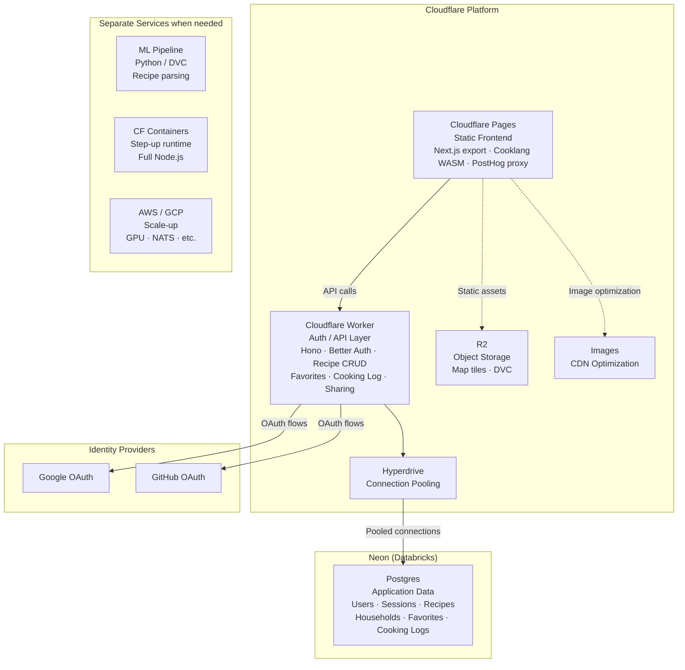

# Summary

Use **Cloudflare Workers (Paid) + Hyperdrive + Neon Postgres** as the backend platform for
authenticated features.

The static frontend stays on Cloudflare Pages. The authenticated backend is a thin Cloudflare
Worker running [Hono](https://hono.dev) with [Better Auth](/projects/recipe-site/adrs/032-better-auth)
for identity, [Drizzle ORM](https://orm.drizzle.team) for data access, and
[Neon](https://neon.com) Postgres as the application database. Heavy processing (ML pipelines,
future import jobs) stays on separate services.

# Context

The recipe site needs a backend layer for authenticated features: OAuth, sessions, recipe editing,
favorites, cooking logs, and household sharing. The current architecture is a static Next.js export
on Cloudflare Pages with no server-side runtime.

The question is not "should we add a backend?" but "which backend shape?"

Three architecture families were evaluated:

| Family                      | Shape                                   | Strengths                                            | Weaknesses                                              |
| --------------------------- | --------------------------------------- | ---------------------------------------------------- | ------------------------------------------------------- |
| **Cloudflare Workers + DB** | Edge runtime beside existing Pages      | Platform continuity, cheapest, near-zero cold starts | V8 isolate constraints, SQLite if using D1              |
| **Node server + Postgres**  | Traditional backend on separate hosting | Maximum flexibility, standard ecosystem              | Most operational overhead, breaks Cloudflare continuity |
| **Convex**                  | Integrated backend platform             | Highest productivity, zero infrastructure            | Document DB, vendor-specific APIs, no real-time need    |

Several constraints narrowed the field:

1. **No real-time requirement.** Household sharing, favorites, and cooking logs are
   request/response. Nobody needs to see a heart icon update live across devices. This removed
   Convex's primary differentiator.
2. **Relational data model preferred.** Auth tables, sharing metadata, and household membership
   are inherently relational. Convex is a document database with no SQL, no JOINs, and no foreign
   keys — a fundamental mismatch.
3. **Postgres ecosystem valued.** Full-text search, vector search, DuckDB integration, and PostGIS
   for other projects make Postgres the long-term database. Starting on SQLite/D1 and migrating
   later creates schema rewrite debt — the Drizzle ORM community strongly recommends starting with
   the target dialect.
4. **Split architecture accepted.** The auth/CRUD layer can stay thin. Heavy processing (ML
   pipelines, import jobs, background workers) lives on separate services. This means Workers'
   runtime constraints don't limit the broader system.
5. **Solo + agents.** The codebase is built with agent-assisted workflows. All configuration should
   live in code. Dashboard-driven platforms are a poor fit.

# Decision

## Architecture

## Component Choices

**Cloudflare Workers Paid ($5/month)** as the auth/API runtime. Workers provide near-zero cold
starts and stay on the same Cloudflare platform as Pages, R2, DNS, and Images. The Paid plan is
required for Hyperdrive access, 30-second CPU time (the free tier's 10ms limit is insufficient for
auth operations), and access to Durable Objects and Queues for future use.

**Neon Postgres** as the application database. Neon is serverless Postgres with scale-to-zero,
database branching for preview environments, and a generous free tier (0.5 GB storage, 100
CU-hours/month). It runs real Postgres — not a Postgres-compatible wire protocol — so every
Postgres tool, ORM, and auth library works without compatibility concerns.

**Hyperdrive** for connection pooling from Workers to Neon. Hyperdrive maintains persistent
connection pools across Cloudflare's global network, eliminating per-request TLS handshake overhead.
Included in the Workers Paid plan at no additional cost. Neon's serverless driver
(`@neondatabase/serverless`) is available as a fallback if Hyperdrive is ever removed.

**Hono** as the HTTP framework. Hono runs on Workers, Node.js, Deno, and Bun — making the handler
code portable if the runtime ever changes. It is lightweight, TypeScript-native, and the most
popular framework for Cloudflare Workers.

**Drizzle ORM** with the Postgres dialect from day one. Starting with Postgres avoids the schema
rewrite debt that would come from starting on SQLite/D1 and migrating later (Drizzle uses different
table constructors per dialect — `sqliteTable()` vs `pgTable()` — and the migration is non-trivial).

## Cost Model

| Component                 | Monthly Cost                                                     |
| ------------------------- | ---------------------------------------------------------------- |
| Cloudflare Pages          | $0 (free tier)                                                   |
| Cloudflare Workers Paid   | $5/month (includes Hyperdrive, 30s CPU, Durable Objects, Queues) |
| Neon Postgres (free tier) | $0 (0.5 GB storage, 100 CU-hours/month)                          |
| Google / GitHub OAuth     | $0                                                               |
| **Total MVP**             | **\~$5/month**                                                   |

Neon's pricing is transparent: $0.106/CU-hour + $0.35/GB-month on the Launch tier. Scale-to-zero
means bursty/low-traffic workloads are dramatically cheaper than always-on databases. The free tier
is sufficient for MVP and likely for a long time beyond.

# Alternatives Considered

## Convex

Convex is an integrated backend platform with database, functions, and reactive sync.

**Why it was considered:** High productivity, zero infrastructure, end-to-end TypeScript type
safety, officially supported Better Auth integration via
[Convex component](https://labs.convex.dev/better-auth).

**Why it was rejected:**

* **Document database, not relational.** Convex has no SQL, no JOINs, no foreign keys. Auth
  tables, sharing metadata, and household membership are inherently relational. Modeling these
  without JOINs means multiple roundtrips and manual data aggregation.
* **No real-time need.** Convex's primary differentiator is reactive sync. The recipe site's
  features (favorites, cooking logs, household sharing) are request/response.
* **DX regret risk.** Convex's function separation is rigid: mutations cannot call external APIs,
  actions cannot write directly to the database. Every "write to DB + call external service"
  operation requires scheduling an action from a mutation with no automatic rollback.
* **Vendor-specific APIs.** Every line of backend code uses Convex's proprietary query syntax.
  Migration away requires a full rewrite (self-hosting is the documented escape hatch).

Convex is now open-source and self-hostable (Docker + SQLite or Postgres). This mitigates vendor
disappearance risk but does not address the data model mismatch or function constraints.

## Node Server + Managed Postgres

A traditional Node.js backend on Railway, Fly.io, or similar hosting with managed Postgres.

**Why it was considered:** Maximum flexibility, standard ecosystem, strongest escape hatch, Better
Auth in its cleanest environment.

**Why it was rejected:**

* **Most operational overhead.** Adds a separate hosting platform, separate database provider,
  connection pooling configuration, and a new deployment pipeline.
* **Breaks Cloudflare continuity.** The site already runs Pages, R2, DNS, and Images on
  Cloudflare. Adding a separate backend host means two platforms, two billing accounts, and
  cross-platform networking.
* **Solves problems not yet encountered.** The auth/CRUD layer is thin enough for Workers. Heavy
  processing is explicitly separate. The full flexibility of a conventional Node server addresses
  constraints that don't exist yet.

## Cloudflare Workers + D1

Workers with D1 (Cloudflare's SQLite-based database) instead of Neon Postgres.

**Why it was considered:** Fewest moving parts, everything on one platform, cheapest.

**Why it was rejected:**

* **SQLite, not Postgres.** The Postgres ecosystem (full-text search, vector search, DuckDB,
  PostGIS for other projects) is explicitly valued. Starting on SQLite creates migration debt.
* **Drizzle schema rewrite.** Drizzle ORM uses different table constructors per dialect. Migrating
  from `sqliteTable()` to `pgTable()` requires rewriting all schema files, regenerating all
  migrations, and adapting for dialect-specific features. The Drizzle community recommends starting
  with the target dialect.
* **Better Auth edge cases on D1.** D1's internal `_cf_METADATA` table causes Kysely introspection
  errors. Better Auth instances must be created per-request (passing the D1 binding each time).
  The `generate` CLI command cannot access D1 from Node.js.

## CockroachDB

CockroachDB Basic (formerly Serverless) offers a generous free tier (10 GiB, 50M RU/month) and a
Postgres-compatible wire protocol.

**Why it was rejected:**

* **Postgres-compatible, not Postgres.** ORM and auth library compatibility is not guaranteed.
  Better Auth and Drizzle are tested against real Postgres, not CockroachDB's distributed SQL
  semantics.
* **Distributed architecture is overkill.** CockroachDB is designed to survive entire region
  failures. A personal recipe site does not need distributed consensus.
* **No native edge driver.** Unlike Neon's `@neondatabase/serverless`, CockroachDB has no
  purpose-built driver for Cloudflare Workers.
* **Opaque pricing.** Request Unit-based billing is harder to predict than Neon's CU-hours + GB
  model.

## Timescale

Timescale Cloud runs full Postgres with the TimescaleDB extension for time-series workloads.

**Why it was rejected:**

* **Specialized for time-series.** Hypertables, continuous aggregates, and columnar compression
  are irrelevant for auth tables and recipe storage.
* **No free tier.** Starts at \~$17/month minimum — roughly 3x the total cost of Workers + Neon.
* **No scale-to-zero.** Instances run 24/7 regardless of traffic.
* **No edge driver.** No equivalent to Neon's serverless driver for Workers.

# Neon Acquisition Context

Databricks acquired Neon for approximately $1B in May 2025. Post-acquisition:

* Neon continues operating independently under its own brand
* Prices dropped (storage \~80% reduction, compute 15-25% reduction)
* Databricks launched **Lakebase** (built on Neon's tech) as a managed Postgres product

The long-term trajectory likely trends toward Lakebase integration with the Databricks ecosystem.
This is a mild concern, not an immediate risk. The mitigation is that Neon runs standard Postgres:
`pg_dump` and `pg_restore` to any other Postgres provider (Supabase, Railway, RDS, self-hosted) at
any time. Data portability does not depend on Neon's corporate trajectory.

# Growth Path

The architecture is designed to be extended without wholesale replacement:

**Step-up: Cloudflare Containers.** If V8 isolate constraints compound over time, Cloudflare
Containers (GA April 2026) provide full Docker/Node.js on Cloudflare. The same Neon database and
largely the same Hono handler code work in a Container. This is the first escalation step — staying
on platform while removing runtime constraints.

**Scale-up: CSP (AWS / GCP).** When specialized services are needed — GPU compute for ML pipelines,
NATS for message queuing, managed Kubernetes, or the full service catalog — a real cloud service
provider is the right step. PaaS platforms like Railway sit in a middle ground between VPS
simplicity and CSP flexibility without enough of either to justify the vendor relationship.

**ML pipeline stays separate.** The recipe parsing pipeline (`ml-pipelines/recipe-parsing/`) is
Python/DVC and runs independently. GPU compute for inference is a separate infrastructure decision
(Modal, RunPod, or CSP GPU instances).

# Consequences

## Positive

* **Platform consolidation.** Pages, Workers, R2, DNS, Images, and now the API layer are all on
  Cloudflare — one account, one bill, one set of API tokens.
* **Full Postgres from day one.** No SQLite migration debt. FTS, vector search, and the broader
  Postgres ecosystem are available immediately.
* **Near-zero cold starts.** Workers respond in single-digit milliseconds. Auth flows are fast.
* **Cheap.** $5/month total at MVP. Neon free tier covers the database. No per-MAU auth pricing.
* **Portable code.** Hono runs on Workers and Node.js. Drizzle + Postgres is standard. Migration
  to a different host means redeploying the same code against the same database.
* **Agent-friendly.** All configuration lives in TypeScript and Terraform. No dashboard-driven
  decisions.

## Negative

* **V8 isolate constraints.** Workers cannot run arbitrary Node.js code. Better Auth requires
  `nodejs_compat` flag and has known edge cases (documented in
  [ADR 032](/projects/recipe-site/adrs/032-better-auth)). The `better-auth-cloudflare` package
  addresses these, but they add friction.
* **Two vendors.** Neon adds a second platform relationship alongside Cloudflare. Mitigated by
  standard Postgres portability.
* **Neon acquisition uncertainty.** Databricks' long-term direction may not align with Neon's
  current standalone product. Mitigated by `pg_dump` portability.
* **Hyperdrive dependency.** Connection pooling relies on a Cloudflare-specific service. Fallback
  to Neon's serverless driver exists but with higher per-request latency.

# When To Revisit

Revisit if any of the following become true:

* V8 isolate constraints cause repeated friction beyond what `better-auth-cloudflare` addresses
* Neon's product direction changes materially post-Databricks acquisition
* the backend grows beyond thin auth/CRUD into heavy server-side logic that Workers cannot handle
* Cloudflare Containers mature enough to replace Workers as the primary runtime
* Hyperdrive or Neon serverless driver introduces breaking changes
